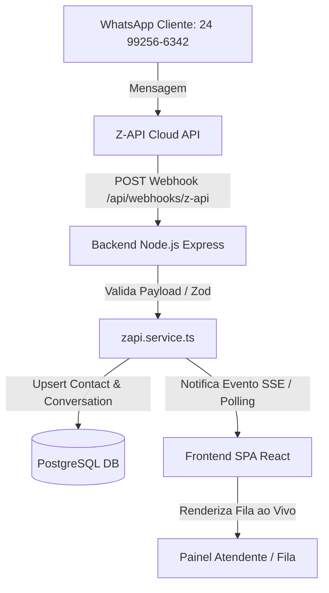

# Plan 001: Integração WhatsApp Z-API, Gestão de Filas em Tempo Real, Autenticação e RBAC

> **Agente de IA Líder de Planejamento**: [`tech-lead-architect.agent.md`](../agents/tech-lead-architect.agent.md) (Tech Lead & Arquiteto de Software)  
> **Agentes de IA Executores**:  
> - [`backend-developer.agent.md`](../agents/backend-developer.agent.md) (Módulo Auth, RBAC, Webhooks Z-API, SSE / Polling)  
> - [`frontend-developer.agent.md`](../agents/frontend-developer.agent.md) (Tela de Login, Guardas de Rota, UI da Fila ao Vivo e Chat Composer)  
> - [`security-engineer.agent.md`](../agents/security-engineer.agent.md) (Hash de Senhas bcrypt, Tokens JWT e Segurança de Webhooks)  
>  
> **Referências de Diretrizes e Arquitetura**: [`docs/README.md`](../docs/README.md), [`docs/GUIDELINES.md`](../docs/GUIDELINES.md), [`docs/ARCHITECTURE.md`](../docs/ARCHITECTURE.md), [`docs/API.md`](../docs/API.md)

---

## 1. Diagnóstico da Situação Atual

Ao conectar o WhatsApp via QR Code na plataforma (ex: número de suporte `24 99256-6342`), ao enviar uma mensagem de teste, a gestão de filas, visualização em tempo real e ações do atendente não funcionaram como esperado devido aos seguintes pontos identificados no código atual:

1. **Webhook Z-API Não Registrado / Inacessível Localmente**: Em ambiente local (`localhost:3001`), os servidores da Z-API na nuvem não conseguem entregar o evento de mensagem recebida se a URL de webhook não estiver exposta publicamente via túnel (ex: `ngrok` ou `zrok`) e registrada na Z-API.
2. **Ausência de Atualização em Tempo Real (Live Stream)**: O frontend depende de navegação manual ou polling estático, impedindo que novas mensagens apareçam instantaneamente sem recarregar a página (F5).
3. **Ausência de Autenticação e RBAC**: O sistema não possui tela de Login, hash de senhas nem controle de permissões por perfil (`ADMIN` vs `AGENT`), permitindo qualquer usuário acessar áreas administrativas de agentes/departamentos ou impedindo a identificação do atendente logado ao "Assumir" uma conversa.
4. **Fluxo do Bot e Transições de Estado**: A transição entre `BOT` -> `QUEUED` -> `IN_PROGRESS` -> `CLOSED` necessita de validação estrita de rotas para garantir que o atendente consiga assumir a conversa na fila, responder com assinatura e redirecionar entre departamentos.

---

## 2. Visão Geral da Solução

O objetivo deste plano é tornar o sistema GTF-Bot **100% operacional** de ponta a ponta, permitindo:
- Recepção automática e em tempo real de mensagens do WhatsApp (ex: `24 99256-6342`).
- Triagem automatizada pelo bot com opções de menu e direcionamento para a fila do departamento correto.
- Painel operacional da **Fila de Atendimento** atualizado ao vivo (Server-Sent Events / Polling curto).
- Ação de **Assumir Conversa**, **Responder WhatsApp**, **Redirecionar Departamento** e **Encerrar Atendimento**.
- Sistema de **Autenticação (Login/Logout)** e **RBAC (Role-Based Access Control)** onde o **ADMINISTRADOR** gerencia atendentes, departamentos, rotas e integrações, enquanto o **ATENDENTE** gerencia chamados.

---

## 3. Detalhamento Técnico Passo a Passo



---

### Passo 1: Atualização do Schema do Banco de Dados (Prisma ORM)

**Agente Responsável**: [`tech-lead-architect.agent.md`](../agents/tech-lead-architect.agent.md)

1. Alterar `backend/prisma/schema.prisma`:
   - Adicionar campo `password` (String com hash bcrypt) no modelo `Agent`.
   - Garantir enum/valores de `role`: `ADMIN`, `SUPERVISOR`, `AGENT`.
   - Adicionar modelo `UserSession` ou expiração de token JWT se necessário.

```prisma
model Agent {
  id            String         @id @default(uuid())
  name          String
  email         String         @unique
  password      String         // Hash bcrypt da senha
  role          String         @default("AGENT") // "ADMIN" | "SUPERVISOR" | "AGENT"
  departmentId  String?        @map("department_id")
  isOnline      Boolean        @default(false) @map("is_online")
  createdAt     DateTime       @default(now()) @map("created_at") @db.Timestamptz
  department    Department?    @relation(fields: [departmentId], references: [id])
  conversations Conversation[]
  messages      Message[]

  @@map("gtf_agents")
}
```

2. Executar migração do Prisma e atualizar o arquivo de seed (`prisma/seed.ts`):
   - Criar usuário padrão Administrador: `admin@torreforte.com.br` / `admin123`.
   - Criar atendentes de teste vinculados aos departamentos de Suporte T.I. e Infraestrutura.

---

### Passo 2: Módulo de Autenticação e Middleware RBAC (Backend)

**Agente Responsável**: [`backend-developer.agent.md`](../agents/backend-developer.agent.md) & [`security-engineer.agent.md`](../agents/security-engineer.agent.md)

1. Instalar bibliotecas de autenticação no backend: `bcryptjs` e `jsonwebtoken` (com `@types/bcryptjs` e `@types/jsonwebtoken`).
2. Criar o módulo `backend/src/modules/auth/`:
   - `auth.routes.ts`:
     - `POST /api/auth/login` (Credenciais email + password)
     - `GET /api/auth/me` (Retorna dados do agente logado via token JWT)
     - `POST /api/auth/logout`
   - `auth.controller.ts`: Valida requisições com Zod schema (`loginSchema`).
   - `auth.service.ts`: Compara hash bcrypt da senha, gera token JWT com ID, email e role.
   - `auth.middleware.ts`: Middleware `authMiddleware` para validar header `Authorization: Bearer <token>` e middleware `requireRole(['ADMIN'])` para proteção de rotas restritas.

---

### Passo 3: Garantia da Conexão Z-API e Registro do Webhook

**Agente Responsável**: [`backend-developer.agent.md`](../agents/backend-developer.agent.md) & [`devops-infra-engineer.agent.md`](../agents/devops-infra-engineer.agent.md)

1. Ajustar `zapi.service.ts` e `zapi.controller.ts`:
   - Quando o status mudar para **Conectado**, expor botão/ação automática para registrar a URL de webhook pública na Z-API via endpoint `update-webhook-received`.
   - Fornecer instrução e script para uso de túnel HTTPS local em desenvolvimento (`npx localtunnel --port 3001` ou `ngrok http 3001`).
2. Tratar no webhook `POST /api/webhooks/z-api`:
   - Mídias (imagens, áudios, documentos) além de mensagens de texto puro.
   - Atualização automática de status da conversa para `QUEUED` caso o cliente escolha uma opção válida do menu do bot.
   - Emissão de evento de barramento (`EventEmitter` interno no backend) para notificação instantânea dos clientes conectados.

---

### Passo 4: Atualização da Fila em Tempo Real (Live Stream / Server-Sent Events)

**Agente Responsável**: [`backend-developer.agent.md`](../agents/backend-developer.agent.md) & [`frontend-developer.agent.md`](../agents/frontend-developer.agent.md)

1. **Backend**:
   - Criar rota `GET /api/conversations/stream` usando Server-Sent Events (SSE) ou configurar curto tempo de revalidação inteligente no React Query (`refetchInterval: 3000`).
2. **Frontend**:
   - No hook `useConversations` (`frontend/src/pages/queue/hooks/useConversations.ts`), manter sincronização contínua com a API.
   - Adicionar efeito sonoro discreto/notificação visual quando um novo chamado der entrada na Fila (`QUEUED`).

---

### Passo 5: Tela de Login e Proteção de Rotas com RBAC (Frontend)

**Agente Responsável**: [`frontend-developer.agent.md`](../agents/frontend-developer.agent.md)

1. Criar a página de Login em `frontend/src/pages/login/index.tsx`:
   - Form visual moderno no tema escuro (`docs/DESIGN_SYSTEM.md`).
   - Armazenamento do token JWT em `localStorage` e estado global de autenticação (`useAuth`).
2. Implementar Guardas de Rota:
   - Se não autenticado: Redirecionar para `/login`.
   - Se perfil for `AGENT` e tentar acessar `/admin/*`: Redirecionar para `/` (Fila) com mensagem "Acesso restrito a administradores".
   - Se perfil for `ADMIN`: Acesso liberado para `/admin/departments`, `/admin/agents`, `/admin/flow`, `/admin/zapi`.
3. Atualizar o Header/Shell (`frontend/src/app/Shell.tsx`):
   - Exibir nome do atendente logado, badge de perfil (`ADMIN` / `ATENDENTE`), seletor de presençã Online/Offline e botão de Sair (Logout).

---

### Passo 6: Operações de Fila (Assumir, Responder, Redirecionar e Encerrar)

**Agente Responsável**: [`frontend-developer.agent.md`](../agents/frontend-developer.agent.md)

1. **Botão Assumir Conversa**:
   - Na lista ou detalhes da conversa `QUEUED`, o atendente clica em "Assumir".
   - Endpoint `POST /api/conversations/:id/assume` é chamado enviando o ID do atendente logado.
   - Status altera para `IN_PROGRESS` e atribui o atendente.
2. **Composer de Mensagem (Enviar WhatsApp)**:
   - Ao digitar no campo de resposta e enviar, dispara `POST /api/conversations/:id/messages`.
   - O backend salva a mensagem com `direction: "OUT"`, `senderType: "AGENT"` e envia a mensagem real via Z-API (`zapiService.sendText`).
3. **Redirecionar Departamento**:
   - Modal para selecionar novo departamento. Endpoint `PATCH /api/conversations/:id/transfer` atualiza o departamento e retorna o status para `QUEUED` do novo departamento.
4. **Encerrar Conversa**:
   - Botão "Encerrar Atendimento" dispara `POST /api/conversations/:id/close`, marca `status: "CLOSED"` e registra `closedAt`.

---

## 4. Cronograma e Ordem de Execução Recomendada

| Etapa | Ação | Agente Principal | Duração Est. |
| :--- | :--- | :--- | :--- |
| **Etapa 1** | Schema Prisma (senha + roles), migração e seed admin | `tech-lead-architect` | 30 min |
| **Etapa 2** | Backend Auth (JWT/bcrypt, rotas `/api/auth` e middleware RBAC) | `backend-developer` | 45 min |
| **Etapa 3** | Ajuste do Webhook Z-API + Suporte a Túnel/Eventos Live | `backend-developer` | 45 min |
| **Etapa 4** | Tela de Login, Auth Provider e Guarda de Rotas RBAC no Frontend | `frontend-developer` | 60 min |
| **Etapa 5** | Operações da Fila ao Vivo (Assumir, Responder Z-API, Encerrar) | `frontend-developer` | 60 min |
| **Etapa 6** | Teste E2E de ponta a ponta com número WhatsApp 24 99256-6342 | `qa-testing-engineer` | 30 min |

---

## 5. Plano de Testes e Homologação (Passo a Passo)

1. **Teste de Autenticação e RBAC**:
   - Fazer login com `admin@torreforte.com.br` -> Acessar `/admin/agents` e cadastrar novo atendente.
   - Fazer login com o novo atendente -> Verificar se o acesso às telas `/admin/*` é bloqueado com segurança.
2. **Teste de Recepção de Mensagem WhatsApp (24 99256-6342)**:
   - Configurar o túnel da Z-API e enviar uma mensagem do celular pessoal para o número `24 99256-6342`.
   - Confirmar que o bot responde instantaneamente com o menu de opções.
3. **Teste de Entrava na Fila**:
   - Responder ao bot escolhendo uma opção (ex: "1" para Suporte T.I.).
   - Verificar no painel web que a conversa entra no status `QUEUED` (Na Fila).
4. **Teste de Atendimento Humano**:
   - Atendente logado clica em **Assumir Conversa**. Status muda para `IN_PROGRESS`.
   - Atendente envia mensagem pela plataforma. Confirmar recepção da mensagem no WhatsApp do celular do cliente.
   - Atendente clica em **Encerrar Conversa**. Confirmar status `CLOSED`.
