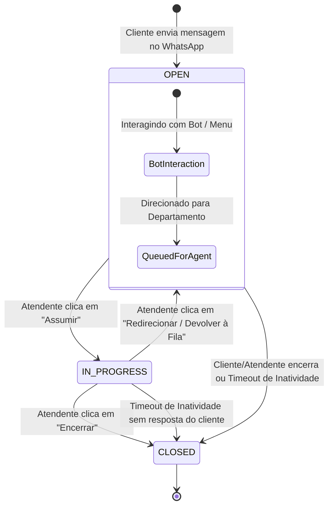

# PRD — Encerramento Automático por Inatividade e Unificação de Status (`OPEN`, `IN_PROGRESS`, `CLOSED`)

> **Documento de Requisitos de Produto (PRD)**  
> **Status**: Proposto / Em Planejamento  
> **Data**: Agosto de 2026  
> **Referências de Documentação**: [`docs/README.md`](README.md), [`docs/PRD.md`](PRD.md), [`docs/ARCHITECTURE.md`](ARCHITECTURE.md), [`docs/API.md`](API.md)  
> **Referência de Agentes**: [`agents/README.md`](../agents/README.md)

---

## 1. Visão Geral e Problema de Negócio

### 1.1 O Problema
Atualmente, no sistema **GTF-Bot**, a automação do bot no WhatsApp só responde a uma nova chamada quando a conversa não está ativa com um atendente. Isso gera dois problemas operacionais críticos:

1. **Chamados "Esquecidos" ou Abandonados**: Quando um atendente humano assume um chamado ou o cliente para de responder sem encerrar a sessão, a conversa permanece em aberto indefinidamente. O bot não volta a atuar e novos contatos do mesmo cliente continuam caindo em um chamado abandonado.
2. **Complexidade de Status (`BOT`, `QUEUED`, `IN_PROGRESS`, `CLOSED`)**: Ter 4 status visíveis gera confusão cognitiva na equipe. As etapas `BOT` (interação inicial automatizada) e `QUEUED` (na fila aguardando humano) representam conceitualmente a mesma situação do ponto de vista do atendente: **chamados que estão abertos e aguardando resolutividade**.

### 1.2 A Solução
1. **Unificação dos Status**: Agrupar `BOT` e `QUEUED` em um único status universal chamado **`OPEN` ("Em Aberto")**.
2. **Mecanismo de Encerramento Automático (Auto-Close Timeout)**: Uma rotina de segundo plano que detecta inatividade de resposta do cliente, envia um aviso prévio no WhatsApp e encerra o chamado automaticamente caso o cliente permaneça em silêncio.

---

## 2. Requisitos Funcionais

### 2.1 Unificação do Fluxo de Status de Atendimento

O ciclo de vida dos chamados passa a ter apenas **3 status principais**:

#### Tabela de Mapeamento de Status:

| Status Antigo | Novo Status | Rótulo Visual na UI | Descrição |
| :--- | :--- | :--- | :--- |
| `BOT` | **`OPEN`** | **Em Aberto** (Sub-etapa: Bot) | Cliente está navegando no menu interativo ou respondendo à triagem do bot. |
| `QUEUED` | **`OPEN`** | **Em Aberto** (Sub-etapa: Fila) | Cliente concluiu o bot e está na fila de um departamento aguardando atendente. |
| `IN_PROGRESS` | **`IN_PROGRESS`** | **Em Atendimento** | Chamado assumido por um atendente humano responsável. |
| `CLOSED` | **`CLOSED`** | **Encerrada** | Chamado finalizado manualmente ou por timeout automático. |

---

### 2.2 Encerramento Automático por Inatividade (Auto-Close Routine)

O sistema executará um worker periódico em segundo plano para monitorar o tempo decorrido desde a última mensagem enviada pelo cliente.

#### Regras de Operação do Timeout:

1. **Gatilho de Inatividade**:
   - Válido para chamados nos status `OPEN` (na etapa de Fila) e `IN_PROGRESS`.
   - Contagem baseada na data/hora da última mensagem do cliente (`lastClientMessageAt`).

2. **Fase 1 — Aviso de Inatividade (Warning Notice)**:
   - Limite configurável (Padrão: **30 minutos** sem resposta do cliente).
   - O sistema dispara uma mensagem no WhatsApp do cliente via Z-API:
     > ⚠️ *"Aviso de Inatividade: Olá! Notamos que você não respondeu à nossa última mensagem no chamado #{id}. Caso não haja interação nos próximos 15 minutos, este atendimento será encerrado automaticamente."*
   - O chamado recebe a flag `warningSentAt = Data/Hora Atual`.

3. **Fase 2 — Encerramento Automático (Auto-Close Execution)**:
   - Limite configurável (Padrão: **15 minutos** após o envio do aviso sem nova resposta do cliente).
   - O sistema realiza o encerramento do chamado:
     - Altera status para `CLOSED`.
     - Grava `closedAt = Data/Hora Atual` e `closeReason = "AUTO_TIMEOUT"`.
     - Envia mensagem final no WhatsApp via Z-API:
       > ℹ️ *"Atendimento Encerrado: O seu chamado #{id} foi encerrado automaticamente por inatividade. Se ainda precisar de suporte, basta enviar uma nova mensagem!"*
     - Registra mensagem de sistema no histórico interno do chamado.

4. **Cancelamento do Timeout se o Cliente Responder**:
   - Se o cliente enviar qualquer mensagem enquanto o chamado estiver aguardando no aviso, a flag `warningSentAt` é resetada e a contagem de inatividade reiniciada.

---

### 2.3 Gestão e Configurações Administrativas

No painel de administração (`/admin/flow` ou `/admin/settings`), o Administrador poderá configurar:

- `autoCloseEnabled`: Ativar/Desativar rotina de encerramento automático.
- `inactivityWarningMinutes`: Minutos de inatividade para envio do aviso (ex: 30 min).
- `autoCloseDelayMinutes`: Minutos após o aviso para encerrar o chamado (ex: 15 min).
- Mensagens personalizadas do aviso e do encerramento.

---

## 3. Mapeamento dos Agentes de IA Especializados

Conforme o repositório de agentes em [`agents/README.md`](../agents/README.md), a execução destas mudanças envolverá os seguintes papéis:

| Agente de IA | Arquivo de Especificação | Papel e Responsabilidades na Tarefa |
| :--- | :--- | :--- |
| **Product Manager (Líder da PRD)** | [`product-manager.agent.md`](../agents/product-manager.agent.md) | Autoria das regras de negócio do PRD, especificações dos templates de mensagens e validação dos critérios de aceite. |
| **Tech Lead & Arquiteto** | [`tech-lead-architect.agent.md`](../agents/tech-lead-architect.agent.md) | Projeto da migração do banco Prisma (`schema.prisma`), unificação dos enums de status e arquitetura da rotina de background (Worker / Cron). |
| **Desenvolvedor Backend** | [`backend-developer.agent.md`](../agents/backend-developer.agent.md) | Implementação da rotina de monitoramento de inatividade em `backend/src/modules/conversations/`, refatoração de endpoints e integração Z-API. |
| **Desenvolvedor Frontend** | [`frontend-developer.agent.md`](../agents/frontend-developer.agent.md) | Atualização do painel da Fila de Atendimento para exibir a aba única **"Em Aberto"**, novos filtros e sinalização visual de inatividade. |
| **Engenheiro de QA & Testes** | [`qa-testing-engineer.agent.md`](../agents/qa-testing-engineer.agent.md) | Criação de suíte de testes de timeout, simulação de mensagens concorrentes durante o aviso e testes de regressão dos status. |

---

## 4. Critérios de Aceite e Regras de Qualidade

1. **Unificação dos Status**:
   - [ ] As abas/filtros no frontend agora exibem apenas **Em Aberto** (`OPEN`), **Em Atendimento** (`IN_PROGRESS`) e **Encerradas** (`CLOSED`).
   - [ ] Chamados iniciados no bot recebem status `OPEN` com indicador visual de etapa ("No Bot" ou "Aguardando Atendente").

2. **Encerramento Automático**:
   - [ ] Chamados inativos recebem a mensagem de aviso no WhatsApp via Z-API exatamente após atingirem o limite configurado (ex: 30 min).
   - [ ] Se o cliente responder ao aviso, a notificação é anulada e o chamado permanece ativo.
   - [ ] Se o cliente não responder, o chamado fecha automaticamente (`CLOSED`) com motivo `AUTO_TIMEOUT` e o cliente recebe a confirmação no WhatsApp.
   - [ ] Ao enviar uma mensagem após o encerramento, um NOVO chamado é aberto em `OPEN`, permitindo que o bot responda novamente do início.
