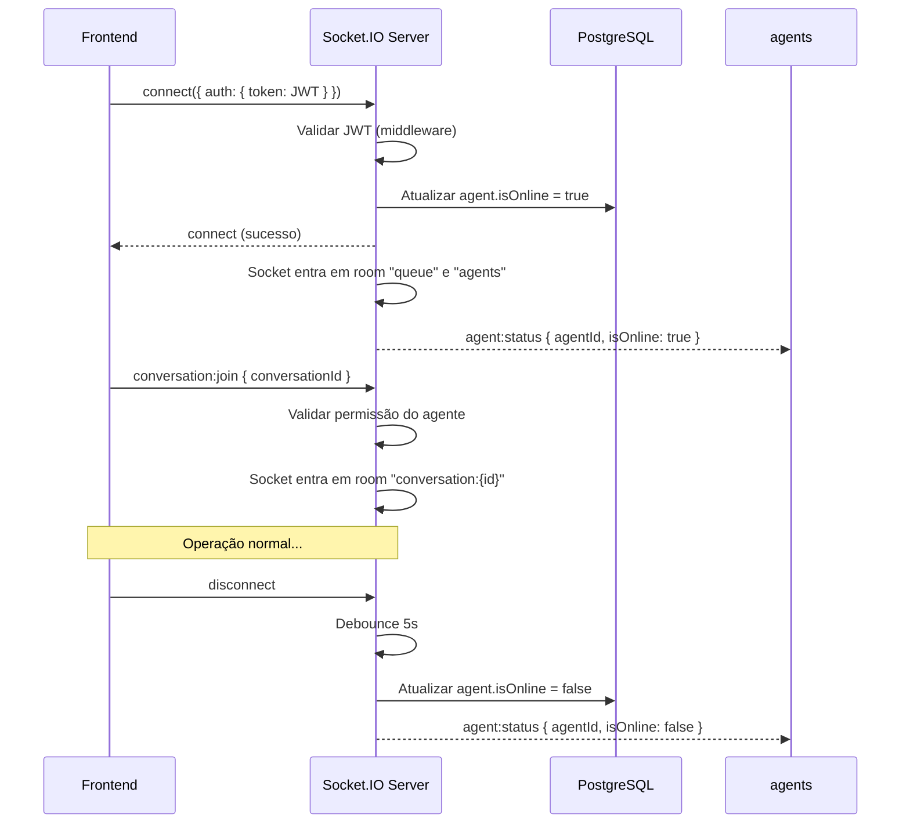
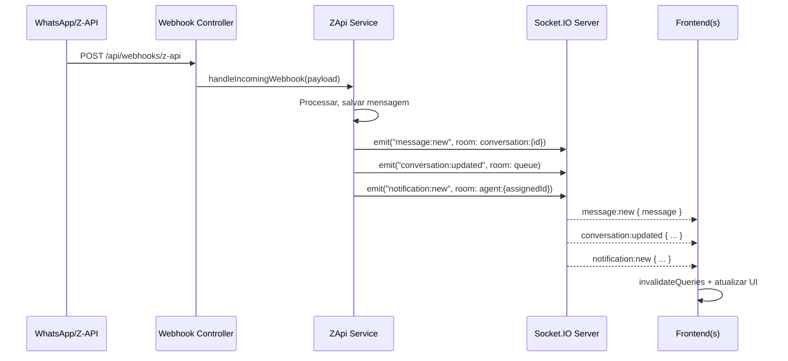

# PRD — Implementação de Socket.IO (Tempo Real)

## 1. Visão Geral

O GTF-Bot atualmente utiliza **polling HTTP a cada 10 segundos** (React Query `refetchInterval`) e um endpoint **SSE** (`GET /api/conversations/events`) para manter a interface parcialmente sincronizada. Esse modelo possui latência perceptível de até 10s, gera tráfego HTTP desnecessário e não suporta funcionalidades avançadas como indicador de digitação, presença em tempo real e notificações instantâneas.

Este PRD especifica a adoção do **Socket.IO** como camada de comunicação bidirecional em tempo real entre o backend Node.js/Express e o frontend React/Vite, substituindo o polling e o SSE por eventos push instantâneos.

---

## 2. Objetivos

1. **Latência zero perceptível**: Mensagens, mudanças de status e notificações chegam instantaneamente sem polling.
2. **Presença em tempo real**: Indicadores de online/offline dos atendentes atualizados ao vivo.
3. **Typing indicators**: Indicador "digitando..." visível para atendente e contato (via webhook).
4. **Notificações push**: Alertas sonoros e visuais para novas mensagens, novos chamados na fila e atribuições.
5. **Escalabilidade**: Arquitetura baseada em rooms e namespaces preparada para múltiplas instâncias.
6. **Redução de carga**: Eliminar polling HTTP de 10s, reduzindo requisições ao servidor em ~90%.

---

## 3. Diagnóstico do Estado Atual

### 3.1 Backend — Sistema de Eventos Interno

O backend já possui um `EventEmitter` interno em [`backend/src/shared/events.ts`](file:///c:/Users/ESTUDIO-TREINAMENTO/Desktop/botSupport/backend/src/shared/events.ts):

```typescript
export const conversationEvents = new EventEmitter();
// Eventos: 'conversation_updated', 'message_received'
```

**Pontos de emissão** (5 em `conversations.service.ts` + 4 em `zapi.service.ts`):

| Arquivo | Evento | Contexto |
|---|---|---|
| `conversations.service.ts` | `conversation_updated` | markAsRead, assume, close, sendMessage, transfer |
| `zapi.service.ts` | `conversation_updated` | webhook recebido, fluxo executado, rota selecionada, menu enviado |

**Listener SSE** em [`conversations.controller.ts`](file:///c:/Users/ESTUDIO-TREINAMENTO/Desktop/botSupport/backend/src/modules/conversations/conversations.controller.ts#L104-L121):

```typescript
async streamEvents(req, res) {
  res.setHeader("Content-Type", "text/event-stream");
  conversationEvents.on("conversation_updated", listener);
  req.on("close", () => conversationEvents.removeListener(...));
}
```

### 3.2 Frontend — Polling React Query

Em [`frontend/src/lib/query-client.ts`](file:///c:/Users/ESTUDIO-TREINAMENTO/Desktop/botSupport/frontend/src/lib/query-client.ts):

```typescript
export const queryClient = new QueryClient({
  defaultOptions: {
    queries: {
      staleTime: 1000 * 5,
      refetchInterval: 1000 * 10, // polling a cada 10s
    },
  },
});
```

### 3.3 Problemas identificados

| Problema | Impacto |
|---|---|
| Polling de 10s em todas as queries | Latência de até 10s para novas mensagens aparecerem |
| SSE unidirecional sem autenticação granular | Não suporta typing, presença, rooms |
| Sem notificações push | Atendente precisa ficar olhando a tela |
| Presença por campo `isOnline` manual | Não reflete desconexões reais |
| Sem typing indicator | UX inferior em chats ao vivo |

---

## 4. Arquitetura Proposta

### 4.1 Visão de Alto Nível

```
┌─────────────────────────────────────────────────────┐
│  Frontend (React/Vite)                              │
│                                                     │
│  ┌──────────────┐  ┌──────────────┐                 │
│  │SocketProvider│  │ React Query  │                 │
│  │  (Context)   │──│ Invalidation │                 │
│  └──────┬───────┘  └──────────────┘                 │
│         │ socket.io-client                          │
└─────────┼───────────────────────────────────────────┘
          │ WebSocket (ws://) + polling fallback
          │ JWT auth no handshake
┌─────────┼───────────────────────────────────────────┐
│  Backend│(Express + Socket.IO Server)               │
│         ▼                                           │
│  ┌──────────────┐                                   │
│  │  Socket.IO   │──── Rooms por conversa            │
│  │   Server     │──── Room global "agents"          │
│  │  (HTTP srv)  │──── Namespace /notifications      │
│  └──────┬───────┘                                   │
│         │                                           │
│  ┌──────▼───────┐  ┌──────────────┐                 │
│  │EventEmitter  │  │   Services   │                 │
│  │(events.ts)   │──│ (emit events)│                 │
│  └──────────────┘  └──────────────┘                 │
└─────────────────────────────────────────────────────┘
```

### 4.2 Namespaces e Rooms

| Namespace | Room | Propósito |
|---|---|---|
| `/` (default) | `conversation:{id}` | Mensagens, status e typing de uma conversa específica |
| `/` (default) | `queue` | Lista geral de conversas (novos chamados, mudanças de status) |
| `/` (default) | `agents` | Presença de atendentes (online/offline) |
| `/notifications` | `agent:{id}` | Notificações pessoais do atendente |

### 4.3 Autenticação

O handshake do Socket.IO validará o JWT enviado via `auth.token`:

```typescript
io.use(async (socket, next) => {
  const token = socket.handshake.auth?.token;
  if (!token) return next(new Error("Token ausente"));
  try {
    const payload = jwt.verify(token, JWT_SECRET);
    socket.data.agent = payload;
    next();
  } catch {
    next(new Error("Token inválido"));
  }
});
```

---

## 5. Eventos Socket.IO — Catálogo Completo

### 5.1 Eventos do Servidor → Cliente (Emitidos pelo backend)

| Evento | Room/Target | Payload | Descrição |
|---|---|---|---|
| `conversation:updated` | `queue` | `{ conversationId, status, departmentId, unreadCount }` | Conversa mudou de status, dept ou teve nova mensagem |
| `conversation:new` | `queue` | `{ conversation }` | Nova conversa criada (webhook) |
| `message:new` | `conversation:{id}` | `{ message }` | Nova mensagem recebida ou enviada |
| `message:read` | `conversation:{id}` | `{ conversationId, readAt }` | Mensagens marcadas como lidas |
| `conversation:assumed` | `conversation:{id}` + `queue` | `{ conversationId, agentId, agentName }` | Atendente assumiu a conversa |
| `conversation:closed` | `conversation:{id}` + `queue` | `{ conversationId }` | Conversa encerrada |
| `conversation:transferred` | `conversation:{id}` + `queue` | `{ conversationId, departmentId, departmentName }` | Conversa transferida |
| `typing:update` | `conversation:{id}` | `{ conversationId, agentId, agentName, isTyping }` | Indicador de digitação |
| `agent:status` | `agents` | `{ agentId, isOnline, lastSeen }` | Presença do atendente mudou |
| `notification:new` | `agent:{id}` (namespace `/notifications`) | `{ type, title, body, conversationId?, timestamp }` | Notificação pessoal |

### 5.2 Eventos do Cliente → Servidor (Emitidos pelo frontend)

| Evento | Payload | Descrição |
|---|---|---|
| `conversation:join` | `{ conversationId }` | Entrar na room da conversa aberta |
| `conversation:leave` | `{ conversationId }` | Sair da room ao fechar/navegar |
| `typing:start` | `{ conversationId }` | Atendente começou a digitar |
| `typing:stop` | `{ conversationId }` | Atendente parou de digitar |
| `presence:heartbeat` | `{}` | Heartbeat de presença (a cada 30s) |

---

## 6. Requisitos Funcionais

### RF-01 — Mensagens em Tempo Real

- Quando o webhook Z-API recebe uma mensagem (`zapi.service.ts` → `handleIncomingWebhook`), emitir `message:new` na room `conversation:{id}` e `conversation:updated` na room `queue`.
- Quando o atendente envia mensagem (`conversations.service.ts` → `sendMessage`), emitir os mesmos eventos.
- O frontend deve invalidar o cache do React Query via `queryClient.invalidateQueries` ao receber esses eventos, garantindo dados frescos sem polling.

### RF-02 — Mudanças de Status em Tempo Real

- Ao assumir (`assume`), encerrar (`close`) ou transferir (`transfer`), emitir `conversation:assumed`, `conversation:closed` ou `conversation:transferred` respectivamente.
- Emitir `conversation:updated` na room `queue` para atualizar a lista global.
- O frontend deve reagir atualizando badges, contadores e lista de conversas instantaneamente.

### RF-03 — Presença de Atendentes

- Ao conectar o socket, marcar `isOnline = true` no banco e emitir `agent:status` na room `agents`.
- Ao desconectar, aguardar 5 segundos (debounce para reconexão rápida) e então marcar `isOnline = false` e emitir `agent:status`.
- Heartbeat a cada 30s do cliente para validar conexão ativa.
- A tela de atendentes e o painel de conversas devem refletir o status em tempo real.

### RF-04 — Typing Indicator

- O frontend emite `typing:start` ao começar a digitar (debounced 300ms) e `typing:stop` ao parar (timeout 3s sem tecla).
- O servidor retransmite `typing:update` para todos na room da conversa, exceto o remetente.
- O frontend exibe "Fulano está digitando..." na área de mensagens.

### RF-05 — Notificações

- **Nova mensagem recebida**: Notificar todos os atendentes do departamento da conversa via namespace `/notifications`.
- **Novo chamado na fila**: Notificar atendentes com permissão `conversations:view` do departamento.
- **Conversa assumida**: Notificar o atendente que assumiu (confirmação) e remover da fila dos demais.
- **Transferência**: Notificar atendentes do departamento destino.
- O frontend deve:
  - Exibir toast/badge visual.
  - Tocar som de notificação (configurável).
  - Atualizar contador de não lidas no favicon/tab title.

### RF-06 — Reconexão Automática

- O Socket.IO deve reconectar automaticamente com backoff exponencial.
- Após reconexão, o cliente deve:
  - Reentrar nas rooms ativas.
  - Buscar mensagens perdidas desde a última mensagem conhecida.
  - Sincronizar presença.

---

## 7. Requisitos Não-Funcionais

| Requisito | Especificação |
|---|---|
| **Transporte** | WebSocket primário, polling HTTP como fallback automático |
| **Autenticação** | JWT no handshake; rejeitar conexões sem token válido |
| **Reconexão** | Automática com backoff (1s, 2s, 4s, 8s, max 30s) |
| **Heartbeat** | Ping/pong nativo do Socket.IO (25s) + heartbeat de presença (30s) |
| **Escalabilidade** | Preparado para Redis Adapter futuro (multi-instância) |
| **Segurança** | Validar que o agente tem permissão para acessar a conversa ao fazer `join` |
| **Performance** | Conexão socket não deve impactar o tempo de carga inicial da SPA |
| **Compatibilidade** | Manter API REST funcional; socket é complementar, não substituto |

---

## 8. Modelo de Implementação

### 8.1 Dependências

**Backend** (`backend/package.json`):
```json
{
  "dependencies": {
    "socket.io": "^4.8.0"
  }
}
```

**Frontend** (`frontend/package.json`):
```json
{
  "dependencies": {
    "socket.io-client": "^4.8.0"
  }
}
```

### 8.2 Estrutura de Arquivos — Backend

```
backend/src/
├── server.ts                          # [MODIFY] Criar HTTP server e passar ao Socket.IO
├── shared/
│   ├── events.ts                      # [MODIFY] Manter EventEmitter + bridge para Socket.IO
│   └── socket.ts                      # [NEW] Setup do Socket.IO server, auth, rooms
├── modules/
│   ├── conversations/
│   │   ├── conversations.service.ts   # [MODIFY] Emitir eventos granulares
│   │   └── conversations.controller.ts# [MODIFY] Deprecar SSE streamEvents
│   ├── zapi/
│   │   └── zapi.service.ts            # [MODIFY] Emitir eventos via socket
│   └── socket/                        # [NEW] Módulo Socket.IO
│       ├── socket.gateway.ts          # [NEW] Handlers de eventos do cliente
│       ├── socket.middleware.ts        # [NEW] Auth middleware do socket
│       └── socket.service.ts          # [NEW] Lógica de emissão, rooms e presença
```

### 8.3 Estrutura de Arquivos — Frontend

```
frontend/src/
├── lib/
│   ├── socket-context.tsx             # [NEW] SocketProvider + useSocket hook
│   ├── query-client.ts                # [MODIFY] Remover refetchInterval global
│   └── use-socket-events.ts           # [NEW] Hook genérico para escutar eventos
├── components/
│   └── NotificationToast.tsx          # [NEW] Toast de notificações
├── pages/
│   └── conversation/
│       ├── index.tsx                  # [MODIFY] Usar socket para mensagens
│       └── components/
│           └── TypingIndicator.tsx    # [NEW] Componente "digitando..."
```

### 8.4 Fluxo de Inicialização



### 8.5 Fluxo de Mensagem Recebida (Webhook)



---

## 9. Plano de Migração

### Fase 1 — Infraestrutura (Backend)
1. Instalar `socket.io` no backend.
2. Criar `shared/socket.ts` com setup do servidor Socket.IO.
3. Modificar `server.ts` para criar `http.Server` e passá-lo ao Socket.IO.
4. Criar middleware de autenticação JWT para sockets.
5. Criar `socket.gateway.ts` com handlers de `join`, `leave`, `typing`.
6. Criar `socket.service.ts` com métodos de emissão tipados.

### Fase 2 — Bridge de Eventos (Backend)
1. Modificar `shared/events.ts` para fazer bridge automático: `EventEmitter` → Socket.IO rooms.
2. Enriquecer os eventos emitidos em `conversations.service.ts` com dados suficientes para o frontend.
3. Enriquecer os eventos emitidos em `zapi.service.ts`.
4. Adicionar lógica de presença (connect/disconnect → `isOnline`).

### Fase 3 — Cliente Socket.IO (Frontend)
1. Instalar `socket.io-client` no frontend.
2. Criar `SocketProvider` com contexto React e reconexão automática.
3. Criar hook `useSocketEvent` para escutar eventos tipados.
4. Modificar `query-client.ts` para remover `refetchInterval` global.

### Fase 4 — Integração nas Páginas (Frontend)
1. Integrar socket na página de conversas: mensagens em tempo real.
2. Integrar socket na lista de conversas: novos chamados e status.
3. Adicionar `TypingIndicator` ao chat.
4. Adicionar `NotificationToast` global.
5. Atualizar presença de atendentes em tempo real.

### Fase 5 — Deprecação e Cleanup
1. Deprecar endpoint SSE `GET /api/conversations/events`.
2. Manter API REST como source of truth; socket é canal de notificação.
3. Remover `refetchInterval` de queries individuais.
4. Manter fallback: se socket desconectar, React Query volta a fazer polling temporário.

---

## 10. Segurança

- **Autenticação**: JWT obrigatório no handshake. Conexões sem token são rejeitadas imediatamente.
- **Autorização por Room**: Ao fazer `conversation:join`, verificar que o agente tem permissão `conversations:view` e pertence ao departamento (ou é ADMIN).
- **Rate Limiting**: Limitar eventos `typing:start` a 1 por segundo por socket.
- **Sanitização**: Payloads de eventos são validados com Zod antes de retransmissão.
- **Tokens**: Nenhum token, senha ou credencial Z-API trafega por eventos socket.
- **CORS**: Configurar `origin` do Socket.IO para aceitar apenas origens autorizadas (`localhost:5173` em dev, domínio de produção).

---

## 11. Observabilidade

- Log estruturado (pino) para conexões, desconexões, joins e erros.
- Métricas recomendadas:
  - `socket_connections_active`: gauge de conexões ativas.
  - `socket_events_emitted_total`: contador por tipo de evento.
  - `socket_reconnections_total`: contador de reconexões.
  - `socket_auth_failures_total`: tentativas de conexão não autenticadas.
- Não logar conteúdo de mensagens ou dados pessoais em eventos socket.

---

## 12. Critérios de Aceite

- [ ] O atendente vê novas mensagens do WhatsApp instantaneamente sem refresh manual.
- [ ] A lista de conversas atualiza status e contadores sem polling.
- [ ] O indicador "digitando..." aparece quando outro atendente digita na mesma conversa.
- [ ] A presença (Online/Offline) reflete o estado real da conexão socket.
- [ ] Notificação visual e sonora ao receber nova mensagem ou novo chamado.
- [ ] Reconexão automática após perda de rede, com resincronização de estado.
- [ ] JWT inválido/expirado é rejeitado no handshake.
- [ ] Agente sem permissão não consegue fazer join em conversa de outro departamento.
- [ ] O fallback para polling funciona quando o socket está desconectado.
- [ ] Backend e frontend compilam sem erros (`npm run build`).
- [ ] Nenhum token, credencial ou dado sensível trafega por eventos socket.

---

## 13. Riscos e Mitigações

| Risco | Probabilidade | Impacto | Mitigação |
|---|---|---|---|
| Perda de mensagens durante desconexão | Média | Alto | Fallback para polling + resync ao reconectar |
| Sobrecarga de eventos em alto volume | Baixa | Médio | Throttle por room, debounce de typing |
| JWT expira durante sessão socket | Média | Médio | Listener de expiração, reconexão com refresh token |
| Incompatibilidade com proxies/firewalls | Baixa | Médio | Fallback automático para HTTP polling (nativo do Socket.IO) |
| Presença falsa (tab em background) | Média | Baixo | Heartbeat + Page Visibility API |

---

## 14. Agentes Recomendados para Implementação

Com base nos agentes definidos em [`agents/`](file:///c:/Users/ESTUDIO-TREINAMENTO/Desktop/botSupport/agents):

| Agente | Responsabilidade |
|---|---|
| **Tech Lead / Architect** | Validar arquitetura de namespaces, rooms e bridge de eventos |
| **Backend Developer** | Implementar Socket.IO server, gateway, middleware e service |
| **Frontend Developer** | Implementar SocketProvider, hooks, typing indicator e notificações |
| **Security Engineer** | Revisar autenticação do handshake, autorização por room e sanitização |
| **QA / Testing Engineer** | Criar cenários de teste para reconexão, concorrência e fallback |
| **DevOps / Infra** | Configurar ngrok/proxy para WebSocket, preparar Redis Adapter futuro |

---

## 15. Estimativa de Escopo

| Fase | Complexidade | Arquivos Impactados |
|---|---|---|
| Fase 1 — Infra Backend | Média | 4 novos + 1 modificado |
| Fase 2 — Bridge de Eventos | Média | 3 modificados |
| Fase 3 — Cliente Frontend | Média | 3 novos + 1 modificado |
| Fase 4 — Integração Páginas | Alta | 5+ modificados + 2 novos |
| Fase 5 — Cleanup | Baixa | 2 modificados |

**Total**: ~10 arquivos novos, ~12 arquivos modificados.
