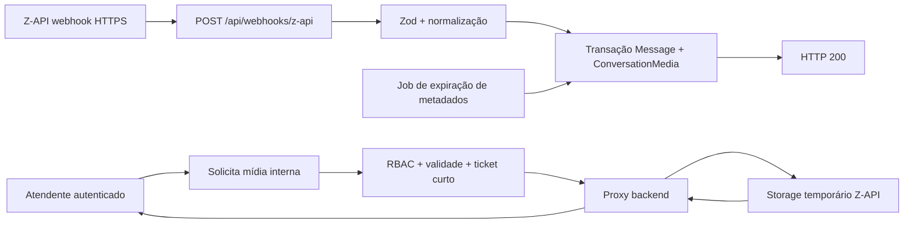

# Plano 012 — Ingestão e exibição de mídia pelo storage temporário da Z-API

> **Status:** Implementado localmente — aguardando homologação com mídias reais da instância Z-API
> **Data:** 2026-08-14
> **Repositório:** `C:\Users\ESTUDIO-TREINAMENTO\Desktop\botSupport`
> **Escopo:** webhook Z-API, mensagens, mídia de conversas, proxy autenticado, RBAC, criptografia, retenção de 30 dias, frontend e observabilidade
> **Agente líder:** [`tech-lead-architect.agent.md`](../agents/tech-lead-architect.agent.md)

## 1. Objetivo

Permitir que imagens, áudios, vídeos e documentos recebidos pelo webhook `on-message-received` da Z-API sejam registrados de forma estruturada e exibidos aos atendentes autorizados dentro da conversa, usando a própria infraestrutura temporária de mídia da Z-API.

O sistema **não copiará os binários para R2, S3, disco local ou banco de dados** nesta entrega. A aplicação guardará somente os metadados necessários e a URL temporária cifrada. Quando um atendente abrir uma mídia, o backend fará proxy do conteúdo armazenado pela Z-API, sem expor a URL de origem ao navegador.

A mídia ficará disponível por até **30 dias**, conforme a janela garantida pela Z-API. Depois de `expiresAt`, a API negará o acesso, limpará as URLs cifradas e a interface exibirá “Mídia expirada”.

## 2. Verificação de viabilidade

### 2.1 Confirmação oficial

A estratégia é viável segundo a documentação oficial:

- A página [Prazo de expiração dos arquivos](https://developer.z-api.io/tips/file-expiration) informa que todos os arquivos de mídia recebidos pelo webhook — incluindo áudio, PDF e imagem — permanecem no storage da Z-API por **30 dias** e são excluídos depois desse período.
- A documentação [Ao receber](https://developer.z-api.io/webhooks/on-message-received) reforça a retenção de 30 dias, exige webhook HTTPS e documenta o registro por `update-webhook-received`.
- Os [exemplos de retorno](https://developer.z-api.io/webhooks/on-message-received-examples) fornecem `imageUrl`, `audioUrl`, `videoUrl` e `documentUrl`, além de `thumbnailUrl`, `downloadError`, `viewOnce`, MIME, dimensões, duração e nome do arquivo.

Portanto, não é necessário manter uma segunda cópia em infraestrutura própria para cumprir a janela desejada. Essa escolha reduz custo, componentes operacionais e superfície de dados.

### 2.2 Condições que precisam ser homologadas

A documentação pública não define SLA, limites de banda, comportamento de `Range`, necessidade de headers adicionais nem formato/host definitivo das URLs. Antes de liberar em produção, a equipe deverá testar com payloads reais da instância:

- `GET` de cada tipo de mídia pelo backend.
- `Range` para áudio e vídeo.
- redirects, hostnames e certificados encontrados.
- `Content-Type`, `Content-Length` e `Content-Disposition` retornados.
- comportamento de `thumbnailUrl`.
- resposta pouco antes e depois da expiração.
- latência e concorrência de vários atendentes.

Se algum desses pontos inviabilizar a reprodução segura, a alternativa R2 deverá ser tratada como uma evolução separada, não ativada implicitamente.

## 3. Referências e estado atual

### 3.1 Documentação interna

- [`docs/README.md`](../docs/README.md): índice oficial do projeto.
- [`docs/PRD.md`](../docs/PRD.md): jornada e estados de `Conversation`.
- [`docs/PRD_ZAPI.md`](../docs/PRD_ZAPI.md): instância única, webhook e integração existente.
- [`docs/API.md`](../docs/API.md): contratos REST e erros.
- [`docs/ARCHITECTURE.md`](../docs/ARCHITECTURE.md): Route → Controller → Service → Repository → Schema e React Query.
- [`docs/GUIDELINES.md`](../docs/GUIDELINES.md): Zod, Prisma, Pino e tratamento de erros.
- [`docs/DESIGN_SYSTEM.md`](../docs/DESIGN_SYSTEM.md): shadcn, superfícies opacas e acessibilidade.
- [`docs/SETUP.md`](../docs/SETUP.md): configuração e deploy.
- [`agents/README.md`](../agents/README.md): seleção dos agentes responsáveis.

### 3.2 Diagnóstico do código

- O endpoint público real já é `POST /api/webhooks/z-api`. O plano estende essa rota e não cria `/webhooks/zapi/message` em paralelo.
- `zapi.service.ts` já registra `update-webhook-received` e normaliza a URL para `/api/webhooks/z-api`. Confirmar a configuração HTTPS da instância é gate operacional, não código novo.
- `parseIncomingMessage` reduz o payload a texto e atualmente descarta a estrutura de mídia.
- A entidade real é `Conversation`, que possui `Message[]`; o novo modelo será `ConversationMedia`, não `TicketMedia`.
- `Message` não tem ID externo universal nem relação de mídia.
- A idempotência em `FlowExecutionEvent.externalEventId` depende de uma revisão de fluxo e não protege toda mensagem recebida.
- O chat renderiza apenas `message.content`.

## 4. Decisões de arquitetura

### 4.1 Arquitetura escolhida



Não haverá BullMQ, Redis, worker de download, R2 nem segunda cópia do binário. O webhook persiste apenas texto, metadados e URLs cifradas, operação curta que pode ser concluída antes do `200`.

### 4.2 Por que não fornecer a URL diretamente

O frontend não receberá `imageUrl`, `audioUrl`, `videoUrl`, `documentUrl` ou `thumbnailUrl` porque:

- a URL pode funcionar como credencial por posse;
- revela fornecedor, host e parâmetros internos;
- impede RBAC após o link ser copiado;
- permite acesso depois do logout enquanto a URL ainda existir;
- dificulta auditoria e revogação.

O backend descriptografa a URL somente depois de autenticar e autorizar o atendente, valida novamente o destino e transmite o conteúdo por streaming. O navegador conhece apenas uma rota interna e um ticket opaco curto.

### 4.3 Idempotência

- `messageId` da Z-API será salvo em `Message.externalMessageId @unique`.
- `ConversationMedia.whatsappMessageId` também será único.
- A transação fará claim/upsert pelo `messageId` antes de criar mensagem, mídia, unread e notificação.
- Webhook duplicado ou concorrente retorna `200` com resultado `duplicate`, sem duplicar registros/eventos.
- Não depender de `FlowExecutionEvent` para a idempotência de mídia.

### 4.4 Retenção

- `MEDIA_RETENTION_DAYS=30`, sem permitir valor maior que a janela do provedor.
- `sourceCreatedAt` será derivado de `momment` quando válido; `expiresAt = sourceCreatedAt + 30 dias`. Se `momment` for inválido, usar o instante de recebimento e registrar métrica.
- Usar a data da Z-API evita prometer 30 dias adicionais quando um webhook for entregue com atraso.
- A API checa `expiresAt` em toda leitura e retorna `410` a partir desse instante, mesmo que a URL ainda responda.
- Job periódico idempotente marca `EXPIRED` e limpa `sourceUrlCiphertext`/`thumbnailUrlCiphertext`.
- A expiração física do binário é responsabilidade da Z-API; a aplicação mantém apenas metadados mínimos para histórico do chamado.

### 4.5 `viewOnce`

Embora o webhook possa trazer URL para `viewOnce=true`, o padrão seguro será não disponibilizar esse conteúdo na plataforma. Registrar como `UNAVAILABLE`, com código interno `VIEW_ONCE_NOT_AVAILABLE`, e mostrar “Mídia de visualização única indisponível”. Armazenar ou retransmitir esse conteúdo exige aprovação explícita de Produto, Segurança/Privacidade e Jurídico.

## 5. Modelo de dados

Migration Prisma aditiva:

```text
Message
  externalMessageId String? @unique @map("external_message_id")
  media             ConversationMedia?

ConversationMedia
  id                     String @id @default(uuid())
  messageId              String @unique
  conversationId         String
  whatsappMessageId      String @unique
  provider               MediaProvider @default(ZAPI)
  type                   MediaType
  status                 MediaStatus
  mimeType               String
  caption                String?
  originalFileName       String?
  title                  String?
  ptt                    Boolean?
  seconds                Int?
  width                  Int?
  height                 Int?
  pageCount              Int?
  viewOnce               Boolean @default(false)
  sourceUrlCiphertext    String?
  thumbnailUrlCiphertext String?
  encryptionKeyVersion   Int
  sourceCreatedAt        DateTime
  expiresAt              DateTime
  failureCode            String?
  lastAccessErrorCode    String?
  lastAccessedAt         DateTime?
  createdAt              DateTime @default(now())
  updatedAt              DateTime @updatedAt

MediaProvider = ZAPI
MediaType = IMAGE | AUDIO | VIDEO | DOCUMENT
MediaStatus = AVAILABLE | UNAVAILABLE | EXPIRED
```

Regras:

- `Message 1 — 0..1 ConversationMedia`, pois o payload tem no máximo uma mídia.
- `Conversation 1 — N ConversationMedia` para autorização e histórico.
- Índices `(conversationId, createdAt)`, `(status, expiresAt)` e unicidade dos IDs externos.
- URLs cifradas com AES-256-GCM ou primitive autenticada equivalente, nonce exclusivo por valor e envelope versionado.
- Chaves ficam fora do banco em secret manager/variável e suportam rotação por `encryptionKeyVersion`.
- `failureCode` é uma enum funcional segura; respostas e logs nunca incluem URL nem erro upstream bruto.

## 6. Webhook e normalização

### 6.1 Schema Zod

Criar schema estrito para:

- campos comuns: `messageId`, `phone`, `momment`, `fromMe`, `type`;
- exatamente zero ou um entre `image`, `audio`, `video`, `document`;
- campos específicos fornecidos no requisito;
- URLs HTTPS e comprimentos máximos;
- dimensões, duração e páginas não negativas;
- família MIME coerente com o tipo;
- `type === "ReceivedCallback"` e regras existentes de grupo/newsletter/fromMe.

Mais de uma mídia, URL inválida ou payload inconsistente retorna `400` controlado. Não guardar payload bruto.

### 6.2 Processamento

1. Validar e normalizar o callback.
2. Resolver `Contact` e `Conversation` segundo as regras atuais.
3. Fazer claim idempotente de `messageId`.
4. Criar `Message` com caption ou rótulo localizado: `[Imagem recebida]`, `[Áudio recebido]`, `[Vídeo recebido]`, `[Documento recebido]`.
5. Se `downloadError != null`, criar `ConversationMedia(UNAVAILABLE, failureCode=ZAPI_DOWNLOAD_ERROR)` sem URL utilizável.
6. Se `viewOnce=true`, aplicar a política definida sem expor URL.
7. Caso normal, cifrar URL principal e thumbnail, criar `AVAILABLE` e calcular `expiresAt`.
8. Atualizar `lastActivityAt`, unread e notificações uma única vez.
9. Emitir `message:new`/`conversation:updated` somente com metadados seguros.
10. Responder `200`; nenhum download ocorre no webhook.

Mensagens sem mídia continuam exatamente no fluxo atual. Mídia sem caption não responde automaticamente a decisões/triagens textuais do FlowEngine.

## 7. API segura de mídia

### 7.1 Metadados

`GET /api/conversations/:conversationId` incluirá em cada mensagem:

```json
{
  "media": {
    "id": "uuid",
    "type": "IMAGE",
    "status": "AVAILABLE",
    "mimeType": "image/jpeg",
    "caption": "texto opcional",
    "fileName": null,
    "width": 1200,
    "height": 800,
    "seconds": null,
    "pageCount": null,
    "ptt": null,
    "viewOnce": false,
    "expiresAt": "2026-09-13T12:00:00.000Z",
    "available": true
  }
}
```

Nunca incluir URL Z-API, URL de thumbnail, ciphertext, chave, nonce, payload bruto ou erro upstream.

### 7.2 Acesso ao conteúdo

- `POST /api/conversations/:conversationId/messages/:messageId/media-access`: autentica, valida `conversations:view`, departamento/atribuição, status e expiração; devolve ticket opaco de 60–120 segundos.
- `GET /api/media/:mediaId/content?ticket=<opaque>`: valida ticket e faz proxy da URL Z-API.
- `GET /api/media/:mediaId/thumbnail?ticket=<opaque>`: proxy opcional da miniatura para imagem.
- `GET /api/media/:mediaId/download?ticket=<opaque>`: download explícito de documento.

O ticket deve ser ligado a `agentId + mediaId + finalidade + expiração`, assinado ou aleatório, não reutilizar JWT e não revelar storage. Para reduzir replay, limitar uso/janela conforme o player permitir.

Respostas:

- `401`: sessão/ticket ausente ou inválido.
- `403`: conversa fora do escopo.
- `404`: mídia inexistente.
- `410`: expirada.
- `422`: indisponível, `downloadError` ou `viewOnce`.
- `502/503`: falha temporária da Z-API.

Headers mínimos: `Cache-Control: private, no-store`, `X-Content-Type-Options: nosniff`, `Referrer-Policy: no-referrer` e `Content-Disposition` sanitizado. O proxy deve encaminhar `Range` somente após homologação e validar `Content-Range`/tamanho do upstream.

## 8. Proxy e segurança

- Descriptografar a URL somente no service depois do RBAC.
- Aceitar apenas HTTPS.
- Criar allowlist a partir dos hostnames reais observados e confirmados com a Z-API.
- Resolver DNS e bloquear loopback, link-local, redes privadas e reservadas IPv4/IPv6.
- Revalidar destino em cada redirect; limitar redirects.
- Aplicar timeout, tamanho máximo por tipo e abortar streaming ao ultrapassar o limite.
- Validar `Content-Type` e fazer sniffing mínimo; nunca confiar apenas no payload/header.
- Não usar `arrayBuffer()`/Buffer integral para arquivos grandes: fazer pipe com backpressure.
- Não repassar cookies, Authorization da aplicação ou headers internos para o host da mídia.
- Não registrar query string do ticket nem URL upstream; sanitizar logs HTTP para a rota.
- Sanitizar filename contra path traversal, CRLF e caracteres de controle.
- Não renderizar HTML/SVG ativo inline; downloads potencialmente executáveis usam `attachment`.
- Rate limit por usuário/mídia e limite de streams simultâneos.
- Cancelar upstream quando o cliente desconectar.

## 9. Frontend

Componentes separados em `frontend/src/pages/conversation/components/`:

- `MessageMedia.tsx`: escolhe componente por tipo/status.
- `ImageAttachment.tsx`: thumbnail interna, imagem lazy e zoom em Dialog opaco.
- `AudioAttachment.tsx`: player sem autoplay, duração e badge “Mensagem de voz” quando `ptt=true`.
- `VideoAttachment.tsx`: player com controles e preload `metadata`.
- `DocumentAttachment.tsx`: nome sanitizado, tipo e botão de download.
- `MediaUnavailable.tsx`: `UNAVAILABLE`, `EXPIRED` e `viewOnce`.
- `use-media-access.ts`: solicita tickets e nunca recebe URL da Z-API.

Regras de UX:

- Componentes shadcn e tokens do design system; cards/balões opacos.
- Caption renderizada como texto, preservando quebras e sem HTML.
- Sem autoplay ou download automático.
- Mostrar “Disponível até dd/mm/aaaa HH:mm”.
- Fila usa caption ou rótulo do tipo como `lastMessage`.
- Um erro temporário da Z-API oferece “Tentar novamente”; expirado não oferece retry.
- Limpar object URLs locais ao desmontar componentes.
- `message:new` invalida a conversa; não é necessário `media:updated`, pois não há processamento assíncrono do binário.

## 10. Expiração e manutenção

Um job leve no backend, seguindo o mecanismo de scheduler/lock já adotado no projeto, executará em lotes:

1. selecionar `AVAILABLE` com `expiresAt <= now`;
2. marcar `EXPIRED`;
3. apagar `sourceUrlCiphertext` e `thumbnailUrlCiphertext`;
4. manter somente metadados mínimos necessários ao histórico;
5. emitir atualização segura para conversas abertas;
6. registrar métricas de quantidade e atraso, sem conteúdo.

A verificação síncrona de `expiresAt` no endpoint é obrigatória; o job apenas higieniza dados e não pode ser a única barreira.

## 11. Configuração

Variáveis novas, apenas com placeholders em `.env.example`:

```text
MEDIA_PROVIDER=ZAPI
MEDIA_RETENTION_DAYS=30
MEDIA_URL_ENCRYPTION_KEY=
MEDIA_URL_ENCRYPTION_KEY_VERSION=1
MEDIA_ALLOWED_SOURCE_HOSTS=
MEDIA_PROXY_TIMEOUT_MS=
MEDIA_MAX_IMAGE_BYTES=
MEDIA_MAX_AUDIO_BYTES=
MEDIA_MAX_VIDEO_BYTES=
MEDIA_MAX_DOCUMENT_BYTES=
MEDIA_MAX_REDIRECTS=2
MEDIA_ACCESS_TICKET_TTL_SECONDS=120
MEDIA_EXPIRATION_JOB_INTERVAL_MINUTES=
MEDIA_MAX_CONCURRENT_STREAMS_PER_AGENT=
```

Não adicionar credenciais R2, Redis, BullMQ ou lifecycle nesta versão. A chave de criptografia deve estar em secret manager e ter runbook de rotação.

## 12. Arquivos previstos

### Backend

- `[MODIFY] backend/prisma/schema.prisma`
- `[NEW] backend/prisma/migrations/<timestamp>_add_conversation_media_zapi/`
- `[MODIFY] backend/src/modules/zapi/zapi.schemas.ts`
- `[MODIFY] backend/src/modules/zapi/zapi.service.ts`
- `[MODIFY] backend/src/modules/zapi/zapi.repository.ts`
- `[NEW] backend/src/modules/media/media.schemas.ts`
- `[NEW] backend/src/modules/media/media.repository.ts`
- `[NEW] backend/src/modules/media/media.service.ts`
- `[NEW] backend/src/modules/media/media.controller.ts`
- `[NEW] backend/src/modules/media/media.routes.ts`
- `[NEW] backend/src/modules/media/media-proxy.service.ts`
- `[NEW] backend/src/modules/media/media-crypto.service.ts`
- `[NEW] backend/src/modules/media/media-expiration.worker.ts`
- `[MODIFY] backend/src/modules/conversations/*`
- `[MODIFY] backend/src/app.ts`, `backend/src/server.ts`, `backend/.env.example`

### Frontend

- `[MODIFY] frontend/src/types/index.ts`
- `[MODIFY] frontend/src/pages/conversation/index.tsx`
- `[NEW] frontend/src/pages/conversation/components/MessageMedia.tsx`
- `[NEW] frontend/src/pages/conversation/components/{Image,Audio,Video,Document}Attachment.tsx`
- `[NEW] frontend/src/pages/conversation/components/MediaUnavailable.tsx`
- `[NEW] frontend/src/pages/conversation/hooks/use-media-access.ts`

### Documentação

- `[MODIFY] docs/PRD.md`
- `[MODIFY] docs/PRD_ZAPI.md`
- `[MODIFY] docs/API.md`
- `[MODIFY] docs/ARCHITECTURE.md`
- `[MODIFY] docs/SETUP.md`
- `[NEW] docs/RUNBOOK_MIDIA_ZAPI.md`
- `[NEW] docs/QA_MIDIA_ZAPI.md`

## 13. Fases de execução

### Fase 0 — Homologação da Z-API

- Confirmar `https://<domínio>/api/webhooks/z-api` em `update-webhook-received`.
- Capturar fixtures anonimizadas reais dos quatro tipos.
- Testar GET, Range, redirects, MIME, tamanho, hostnames, thumbnail, latência e concorrência.
- Aprovar `viewOnce`, limites e allowlist.
- Registrar resultado no runbook; falha crítica interrompe a implementação e reabre a alternativa R2.

### Fase 1 — Banco e contrato

- Criar testes de caracterização do webhook textual e FlowEngine.
- Aplicar migration aditiva.
- Implementar criptografia versionada e teste de rotação.
- Implementar schema Zod e persistência idempotente.

### Fase 2 — Webhook

- Normalizar os quatro objetos de mídia.
- Criar `Message` + `ConversationMedia` na mesma transação.
- Tratar `downloadError`, `viewOnce`, duplicidade e mensagens sem mídia.
- Garantir que logs/eventos não contenham URLs ou payload bruto.

### Fase 3 — Proxy e RBAC

- Implementar ticket curto, proxy streaming, Range, download e headers.
- Implementar SSRF, limites, timeout, cancelamento e MIME.
- Cobrir escopo de administrador, supervisor, departamento e atendente atribuído.

### Fase 4 — Chat

- Implementar renderizadores dos quatro tipos e estados indisponível/expirado.
- Integrar React Query, shadcn, responsividade e acessibilidade.
- Validar duas sessões de atendentes acessando a mesma conversa.

### Fase 5 — Expiração e rollout

- Implementar limpeza de URLs cifradas.
- Testar com retenção curta em homologação.
- Executar segurança, QA, carga e canary por feature flag.
- Monitorar upstream, tráfego proxy, falhas e expiração.

## 14. Matriz de testes

### Webhook/idempotência

- Texto puro permanece igual.
- Cada tipo cria uma mensagem/mídia com metadados corretos.
- Mesmo `messageId`, inclusive concorrente, cria um único conjunto de registros/eventos.
- `downloadError` cria `UNAVAILABLE` sem URL utilizável.
- `viewOnce` segue política aprovada.
- Dois objetos de mídia, URL não HTTPS, MIME incompatível e campos inválidos retornam erro controlado.

### Criptografia/minimização

- Banco nunca contém URL em texto claro.
- Ciphertext adulterado falha fechado.
- Rotação lê versão anterior e escreve versão atual.
- Logs, erros, eventos e DTOs não contêm URL/ciphertext/payload.
- Expiração limpa todos os ciphertexts.

### Proxy/segurança

- Agente autorizado recebe conteúdo; outro departamento recebe `403`.
- Ticket expirado, adulterado, de outro usuário/mídia/finalidade falha.
- Host privado, DNS rebinding, redirect privado, MIME falso, excesso de bytes e timeout são bloqueados.
- Range funciona quando suportado; fallback homologado não carrega arquivo inteiro em memória.
- Filename e caption maliciosos não produzem XSS, CRLF ou path traversal.
- Cliente desconectado cancela upstream.

### Expiração e dependência externa

- Antes de `expiresAt`, acesso funciona; no instante da expiração retorna `410`.
- Job concorrente de limpeza é idempotente.
- `404/410` antecipado da Z-API mostra indisponibilidade sem quebrar a conversa.
- Falha temporária gera `502/503` e permite retry visual.
- Testes com múltiplos atendentes medem latência/banda e não duplicam dados.

### Regressão/frontend

- Bot, triagem, unread, notificações, fila, assumir, transferir e encerrar continuam verdes.
- Imagem, áudio, vídeo e documento funcionam em desktop/mobile e teclado.
- Nenhuma chamada do navegador usa host da Z-API.
- Builds, migration, testes unitários, integração PostgreSQL, E2E e smoke HTTPS passam.

## 15. Critérios de aceite

- [ ] Storage temporário da Z-API é homologado com payloads reais dos quatro tipos.
- [ ] O sistema não mantém cópia binária própria.
- [ ] `POST /api/webhooks/z-api` preserva texto e registra mídia idempotentemente por `messageId`.
- [ ] URLs ficam cifradas e nunca aparecem no frontend, logs, eventos ou erros.
- [ ] Chat exibe imagem, áudio, vídeo e documento via proxy autenticado.
- [ ] RBAC é aplicado no backend e funciona com múltiplos atendentes.
- [ ] `downloadError`, `viewOnce`, falha temporária e expiração têm estados claros.
- [ ] Acesso é bloqueado em `expiresAt` e URLs cifradas são eliminadas.
- [ ] Proxy passa auditoria de SSRF, MIME, limites, ticket e streaming.
- [ ] Documentação, runbook, métricas, alertas e testes estão aprovados.

## 16. Agentes recomendados

O melhor agente líder continua sendo [`tech-lead-architect.agent.md`](../agents/tech-lead-architect.agent.md), porque a solução altera contrato público, banco, criptografia, autorização e streaming.

1. [`product-manager.agent.md`](../agents/product-manager.agent.md): `viewOnce`, mensagens, limites e expectativa de disponibilidade.
2. [`tech-lead-architect.agent.md`](../agents/tech-lead-architect.agent.md): contrato, modelo, idempotência, proxy e invariantes.
3. [`backend-developer.agent.md`](../agents/backend-developer.agent.md): Prisma, Zod, webhook, criptografia, proxy e expiração.
4. [`security-engineer.agent.md`](../agents/security-engineer.agent.md): gate obrigatório de SSRF, RBAC, tickets, criptografia, MIME e logs.
5. [`frontend-developer.agent.md`](../agents/frontend-developer.agent.md): players, downloads, estados, React Query, shadcn e acessibilidade.
6. [`qa-testing-engineer.agent.md`](../agents/qa-testing-engineer.agent.md): fixtures reais, contrato, concorrência, falhas externas, segurança e E2E.
7. [`devops-infra-engineer.agent.md`](../agents/devops-infra-engineer.agent.md): secrets, health, métricas, canary e rotação de chave.

Ordem: Produto fecha gates → Tech Lead congela contrato → Backend cria webhook/proxy → Security aprova → Frontend integra → QA homologa → DevOps conduz canary.

## 17. Riscos e mitigação

| Risco | Impacto | Mitigação |
|---|---|---|
| URL Z-API exposta ao navegador | Alto | URL cifrada + proxy + ticket interno curto |
| Dependência do uptime/latência Z-API | Alto | timeout, retry visual, métricas, canary e fallback futuro documentado |
| Z-API apagar antes do prazo esperado | Alto | `sourceCreatedAt` pelo `momment`, teste real, estado indisponível e alerta |
| Proxy permitir SSRF | Crítico | allowlist, DNS/IP privado bloqueado, redirects revalidados e limites |
| Vídeo/áudio saturar backend | Alto | streaming, Range, concorrência, backpressure e cancelamento |
| Ciphertext ou chave comprometidos | Alto | AEAD, secret manager, rotação, menor acesso e limpeza em 30 dias |
| `viewOnce` violar privacidade | Alto | indisponível por padrão e gate jurídico/segurança |
| Vários atendentes multiplicarem tráfego | Médio | thumbnail, preload metadata, limites e métricas; sem duplicar storage |
| Range não suportado pelo upstream | Médio | homologar antes do frontend e definir fallback limitado |
| URL permanecer após expiração | Alto | bloqueio síncrono + job idempotente de limpeza |

## 18. Rollout e rollback

Feature flags: `MEDIA_ZAPI_INGESTION_ENABLED`, `MEDIA_ZAPI_DISPLAY_ENABLED` e `MEDIA_EXPIRATION_JOB_ENABLED`.

1. Homologar URLs reais antes da migration.
2. Aplicar migration aditiva e ativar apenas ingestão de metadados.
3. Auditar banco/logs para garantir que não há URL em texto claro.
4. Ativar proxy e frontend em um departamento/instância.
5. Monitorar latência, 404/410, bytes e acessos negados.
6. Expandir gradualmente.

Rollback: desligar exibição/ingestão por flags, preservar atendimento textual, manter o job de limpeza por privacidade e não remover a migration. Caso a dependência da Z-API se mostre insuficiente, abrir evolução específica para cópia controlada em storage próprio, sem aumentar retenção automaticamente.

## 19. Definição de concluído

O plano só poderá ser marcado como concluído quando a Z-API estiver homologada com mídias reais, o webhook idempotente persistir URLs cifradas, o proxy aplicar RBAC/SSRF/limites, os quatro componentes funcionarem no chat, a expiração remover as URLs em 30 dias e os gates de Segurança/QA/rollout estiverem aprovados.

## 20. Registro de execução — 2026-08-14

### Implementado

- Migration aditiva `20260814150000_add_zapi_conversation_media`, aplicada no PostgreSQL local e validada com `prisma migrate status`.
- `Message.externalMessageId` e `ConversationMedia.whatsappMessageId` únicos, com criação transacional e tratamento de `P2002` para callbacks concorrentes.
- Schemas Zod para image/audio/video/document, HTTPS, `downloadError`, `viewOnce` e no máximo uma mídia por callback.
- Normalização de `momment` em Unix segundos ou milissegundos, retenção limitada a 30 dias e rótulos localizados.
- AES-256-GCM para URLs, chave versionada, tickets HMAC curtos e DTO público sem URL/ciphertext.
- Proxy com RBAC, finalidade do ticket, allowlist, DNS/IP privado, redirects, MIME, conteúdo ativo, limites de bytes, Range, timeout, backpressure, cancelamento e limite de streams por atendente.
- Flags independentes `MEDIA_ZAPI_INGESTION_ENABLED`, `MEDIA_ZAPI_DISPLAY_ENABLED` e worker idempotente de expiração.
- Chat com primitives shadcn `Message`, `Bubble`, `Attachment`, `Dialog`, `Badge`, `Button` e `Skeleton`; imagem, áudio, vídeo, documento e estados indisponível/expirado.
- API, PRD, arquitetura, setup, runbook e matriz QA atualizados.

### Evidências

- Backend: `40/40` testes aprovados, `0` falhas, `0` TODO; build TypeScript aprovado.
- Frontend: TypeScript + Vite aprovados, `1.920` módulos; somente warning conhecido de chunk acima de 500 kB.
- Banco: sete migrations aplicadas e schema atualizado.
- Smoke API: health `200`, autenticação válida, listagem com 17 conversas e mídia inexistente retornando `404` controlado.
- Smoke browser: fila e conversa carregaram sem erros de console; rolagem, composer e layout permaneceram funcionais após composição shadcn.
- Scan do frontend: nenhuma referência a `imageUrl`, `audioUrl`, `videoUrl`, `documentUrl` ou ciphertext.

### Gate externo restante

Não existem fixtures reais de mídia nem credenciais/URLs da instância autorizadas neste workspace. Antes de marcar o plano como **Concluído em produção**, executar a Fase 0 do runbook: confirmar o webhook HTTPS, enviar os quatro tipos pela instância, registrar somente os hostnames em `MEDIA_ALLOWED_SOURCE_HOSTS`, validar Range/redirects/MIME/latência e realizar canary em um departamento. Esse gate não requer mudança arquitetural e não deve ser contornado com URLs inventadas.
